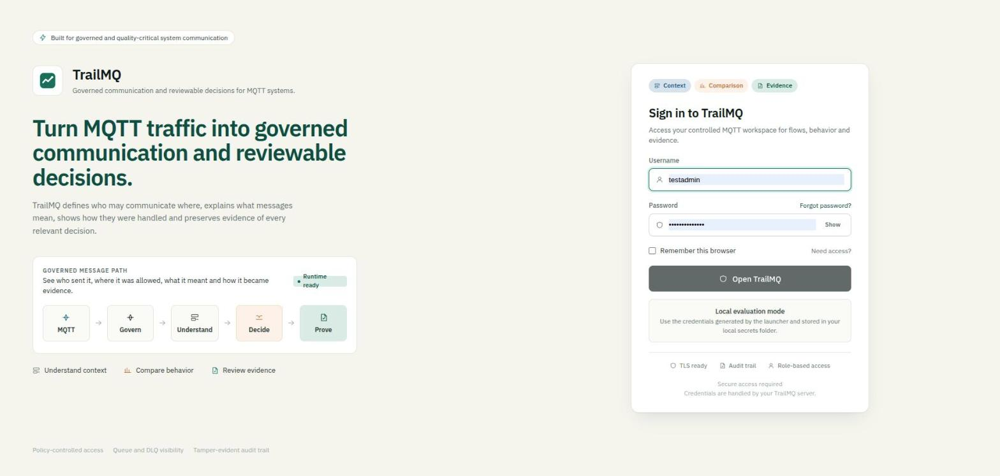
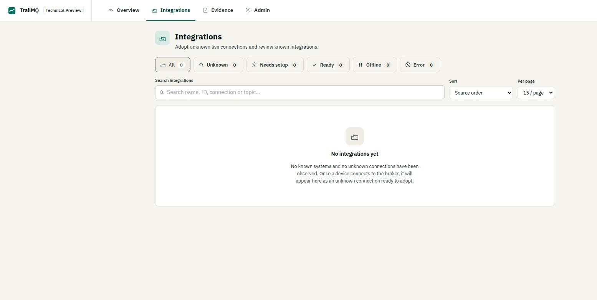
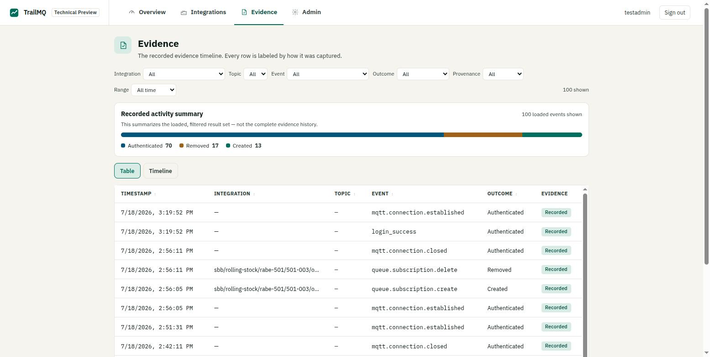
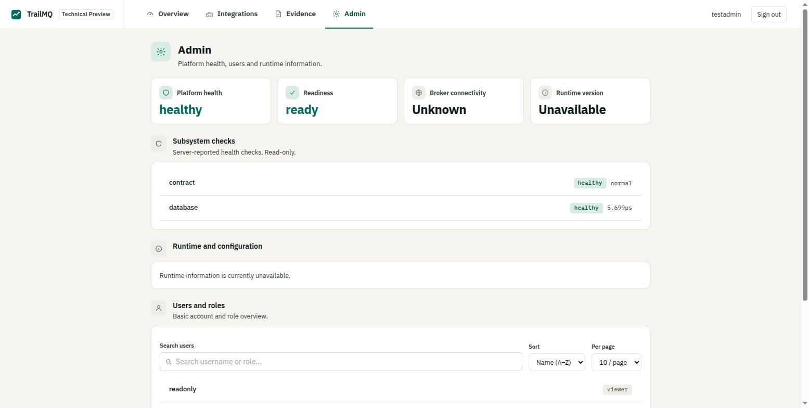

<p align="center"></p>

[](https://hub.docker.com/r/rainergewalt/trailmq-backend)
[](https://hub.docker.com/r/rainergewalt/trailmq-frontend)
[](https://hub.docker.com/r/rainergewalt/trailmq-backend/tags)
[](LICENSE)
[](#quality-security--compliance-readiness)
[](#quality-security--compliance-readiness)

> **Audit-first MQTT control plane.** TrailMQ sits directly in the MQTT message
> path: it authenticates clients, enforces role/topic and message policies
> before routing, and writes hash-linked (SHA-256), tamper-evident records of
> the decisions it takes — who connected, what was published, which policy
> applied, and whether the recorded evidence is still intact.

```bash
git clone https://github.com/RainerGewalt/TrailMQ.git
cd TrailMQ
./trailmq quickstart        # → http://localhost/trailmq/
./trailmq demo              # 2-minute proof: allowed delivery, denied publish, evidence
```

The first command picks the `Secure MQTT Core` stack, generates local demo
certificates and evaluation passwords, and starts everything with Docker.
The second runs a scripted proof against the running stack — one allowed
MQTT delivery, one denied publish, and where to review the recorded
decisions.

---

## What this repository is

This is the **public, Docker-first evaluation package** for **TrailMQ 3.0.0**:

- a **CLI launcher** (`./trailmq`) that wraps Docker Compose,
- ready-to-run **recipes** (starter kits) under [`recipes/`](recipes/),
- the **configuration** and **documentation** you need to evaluate it.

The backend and frontend ship as **Docker images** — their source is not part
of this repo. You don't build anything; you run images and point them at config.

**Who it's for:** engineers evaluating secure, auditable MQTT for industrial,
regulated, or traceability-sensitive environments, and anyone who wants to see
how policy enforcement plus an audit chain behave in practice.

```text
MQTT message → TrailMQ Core (transport + auth)
            → Policy decision (who / what / how)
            → Audit evidence  (hash-linked, tamper-evident record)
```

See [docs/architecture.md](docs/architecture.md) for the full model.

---

## Screenshots

The public images ship the **Evaluation Preview** — a slimmed, scan-first UI
with four surfaces (Overview, Integrations, Evidence, Admin). The advanced
operations UI (**TrailMQ Pro**) is available on request — see [Editions](#editions).

<p align="center">
  
</p>

| Adopt & review integrations | Recorded evidence timeline | Platform & user administration |
| --- | --- | --- |
|  |  |  |
| Detected MQTT connections become adoptable integrations; search, filter and page the loaded set. | Every recorded event, labeled by how it was captured — filter, sort, switch Table/Timeline, replay. | Server health, subsystem checks, runtime info, and searchable users/roles. |

---

## Try it in 30 seconds

Requirements: **Docker 20.10+**, **Docker Compose v2+**, and **Bash** (Linux,
macOS, or WSL).

```bash
git clone https://github.com/RainerGewalt/TrailMQ.git
cd TrailMQ
./trailmq quickstart
```

Wait for Docker to pull the images, then open the Web UI. Default surfaces:

| Surface  | URL or address              |
| -------- | --------------------------- |
| Web UI   | `http://localhost/trailmq/` |
| REST API | `http://localhost/api/v1`   |
| MQTT TLS | `localhost:8883`            |
| MQTT WS  | `ws://localhost/mqtt`       |

Login passwords are generated on first launch and stored in
`recipes/secure-mqtt-core/secrets/`. Print them again any time with:

```bash
./trailmq credentials
```

New here? The [Quickstart](docs/quickstart.md) walks through the first run.

---

## Where do I change what?

Everything you can adjust lives in **two places**: the root `.env` (runtime
knobs like ports and image tags) and the recipe's `config.yaml` (product
behavior). This table maps intent to the exact place:

| I want to change…                  | Edit / run                                                                      |
| ---------------------------------- | ------------------------------------------------------------------------------- |
| Host ports (80, 8883)              | `.env` → `TRAILMQ_HTTP_PORT`, `TRAILMQ_MQTT_TLS_PORT`                            |
| Which images / image tags          | `.env` → `TRAILMQ_BACKEND_IMAGE`, `TRAILMQ_FRONTEND_IMAGE`                       |
| Users, roles, permissions          | `recipes/secure-mqtt-core/config.yaml` → `users:` / `roles:`                     |
| Evaluation passwords               | `recipes/secure-mqtt-core/secrets/*.pwd` (or `./trailmq credentials` to read)    |
| TLS certificates                   | drop into `recipes/secure-mqtt-core/certs/`, or run `./trailmq certs`            |
| Queue / dead-letter behavior       | `recipes/secure-mqtt-core/config.yaml` → `queue_advanced:`                       |
| Audit retention / export           | `recipes/secure-mqtt-core/config.yaml` → `audit_advanced:`, `audit_retention_days:` |
| CORS / WebSocket origins           | `recipes/secure-mqtt-core/config.yaml` → `cors:`, `mqtt_ws_allowed_origins:`     |
| Log verbosity                      | `recipes/secure-mqtt-core/config.yaml` → `log_level:`                            |
| Reverse-proxy routes               | `recipes/secure-mqtt-core/nginx.conf`                                            |

To set custom ports or pin image versions, start from the template:

```bash
cp .env.example .env      # edit, then:
./trailmq start
```

Runtime data, generated certificates, secrets, logs, and audit archives are
**gitignored** — the repository stays clean no matter what you run locally.

---

## Connect a client

TrailMQ *is* the broker. Point any standard MQTT client at the TLS listener,
authenticate with an evaluation user, and publish under a governed namespace.
Clients present username + password over TLS; the server verifies them against
role-based policy before allowing a connect or a publish/subscribe.

| What | Value (default recipe) |
| --- | --- |
| Endpoint (TLS) | `mqtts://localhost:8883` |
| Endpoint (WebSocket) | `ws://localhost/mqtt` |
| CA certificate | `recipes/secure-mqtt-core/certs/ca_cert.pem` |
| Publisher user | `testuser` (publish role) — password via `./trailmq credentials` |
| Admin / subscriber user | `testadmin` (admin role) |

Example — publish a value and read it back (uses [`mosquitto-clients`](https://mosquitto.org/)):

```bash
CA=recipes/secure-mqtt-core/certs/ca_cert.pem
PW=$(cat recipes/secure-mqtt-core/secrets/testuser.pwd)

mosquitto_pub -h localhost -p 8883 --cafile "$CA" \
  -u testuser -P "$PW" \
  -t 'public/demo/temperature' -q 1 \
  -m '{"value":21.4,"unit":"degC"}'
```

The `public/#` namespace is open to all authenticated roles out of the box;
`restricted/#` is admin-only; every other namespace is **deny-by-default**
until a topic grants roles. The connect and every access decision are
recorded — open **Evidence** in the Web UI to review them.

Full guide with Python, Node.js and browser-WebSocket examples:
[Connect a client](docs/connect-a-client.md). Step-by-step walkthroughs
(allowed flow, denied actions, governing a namespace):
[Scenarios](docs/scenarios/). REST details: [Secure MQTT Core
walkthrough](recipes/secure-mqtt-core/README.md).

---

## What you can evaluate

- `./trailmq demo` — a scripted 2-minute proof: allowed delivery, denied
  publish, recorded evidence.
- [Scenarios](docs/scenarios/) — six guided walkthroughs: sensor to
  dashboard, denied by design, governing a namespace, tamper evidence,
  adding your own user, queue & dead letters.
- Overview shows runtime status, lifecycle counts, and recent activity.
- Evidence shows recorded events — every row labeled by how it was captured,
  filterable by outcome (e.g. **Blocked**).

---

## Quality, security & compliance readiness

Every published `v*.*.*` release is cut only from `master` at a commit whose full
CI is green, then built, **cosign-signed (keyless)**, and published by an
automated pipeline.

- **Automated tests** — 750+ frontend unit tests with coverage; Go `-race`, `vet`,
  build, and module verification; live REST/MQTT allow-deny and restart checks on
  the release commit.
- **Supply-chain & security scanning** — dependency-vulnerability, static analysis,
  secret scanning, filesystem scanning, and Dockerfile lint gate the release SHA.
- **Signed, immutable artifacts** — images are content-addressed by digest and
  cosign-signed; signatures are verified before stable tags are promoted.

**Regulatory readiness, stated honestly:**

- **EU Cyber Resilience Act (CRA):** TrailMQ's signed artifacts, vulnerability
  reporting ([SECURITY.md](SECURITY.md)), and continuous scanning *support*
  CRA-readiness work. This is not a conformity assessment or a CE declaration.
- **GxP / GMP / CSV / Annex 11 / 21 CFR Part 11:** TrailMQ can *support*
  traceability and regulated engineering practices, but it does **not** certify a
  system as compliant. Compliance depends on the validated system, procedures,
  users, infrastructure, and the organizational controls around it.

---

## Editions

| | Evaluation Preview (this repo) | TrailMQ Pro |
| --- | --- | --- |
| UI | Four scan-first surfaces: Overview, Integrations, Evidence, Admin | Full operations workspace: deeper governance, decision explanations, live/historical KPI, twin & context views |
| Backend | Full hardened backend image | Same backend |
| Use | Free, local, non-production evaluation | Production & commercial use |
| Availability | Public Docker images | **On request** |

The advanced frontend is not published here yet. If it fits your use case, get in
touch — **contact@trailmq.com** (or [trailmq.com](https://trailmq.com)).

---

## CLI reference

```bash
./trailmq            # prints the command menu
```

| Command                 | Purpose                                      |
| ----------------------- | -------------------------------------------- |
| `./trailmq quickstart`  | One-command local evaluation setup           |
| `./trailmq demo`        | 2-minute guided demo (allow + deny + evidence) |
| `./trailmq start`       | Start or repair the local evaluation setup   |
| `./trailmq launch`      | Guided first run (pick a starter kit)        |
| `./trailmq up`          | Start the active recipe                      |
| `./trailmq down`        | Stop the active recipe                       |
| `./trailmq status`      | Show services, ports, audit state, plugins   |
| `./trailmq open`        | Show local URLs for the active recipe        |
| `./trailmq credentials` | Show generated local evaluation login        |
| `./trailmq logs`        | Tail logs for the active recipe              |
| `./trailmq doctor`      | Check Docker, config, certs, secrets, ports  |
| `./trailmq certs`       | Generate local demo certificates             |
| `./trailmq reset`       | Stop stack and wipe runtime data             |
| `./trailmq purge`       | Remove runtime data, certs, secrets, state   |

---

## Starter Kits

A recipe bundles a specific combination of features into a ready-to-run stack.
You don't "configure TrailMQ" from scratch — you pick a recipe that matches
your goal. They live under [`recipes/`](recipes/).

| Starter kit            | Status    | Purpose                                          |
| ---------------------- | --------- | ------------------------------------------------ |
| Secure MQTT Core       | Available | Policy enforcement, audit trail, evidence chain  |
| Explain Decisions      | Planned   | Decision traces for broker decisions             |
| Live vs Historical KPI | Planned   | Compare live MQTT values with historical context |

The available stack is [`recipes/secure-mqtt-core/`](recipes/secure-mqtt-core/).

---

## Configuration

Copy `.env.example` to `.env` when you need to pin images or avoid local port
conflicts:

```bash
cp .env.example .env
```

Common overrides:

```env
TRAILMQ_HTTP_PORT=8080
TRAILMQ_MQTT_TLS_PORT=8884
TRAILMQ_BACKEND_IMAGE=rainergewalt/trailmq-backend:3.0.0
TRAILMQ_FRONTEND_IMAGE=rainergewalt/trailmq-frontend:3.0.0
```

The current release is **3.0.0**. The recipe defaults to the `3.0.0` release
tags; pinning them in `.env` keeps your evaluation reproducible even after
newer images are published.

Then run:

```bash
./trailmq start
```

## Verification And Release Evidence

The source project defines automated gates for backend Go tests, frontend
type/unit/build checks, Preview bundle verification, Docker image builds,
security scanning, SBOM/provenance, checksums, and cosign signing.

Treat exact test counts, workflow URLs, image digests, SBOMs, attestations, and
signatures as evidence for the specific release tag being evaluated. Do not
treat screenshots, demo records, or local generated data as production evidence.

## CRA And GMP/GxP Boundary

TrailMQ can support security, traceability, evidence review, release identity,
SBOM/provenance, and operational documentation activities that are relevant to
CRA-readiness and regulated environments.

TrailMQ is not a CRA conformity declaration, CE marking, GMP/GxP/CSV validation,
EU GMP Annex 11 compliance package, or 21 CFR Part 11 compliance package by
itself. Validation, intended-use assessment, procedural controls, risk
management, and legal/regulatory determinations remain the deployer's
responsibility.

## Repository Map

```text
TrailMQ/
├── trailmq                     CLI launcher (start here)
├── .env.example                runtime overrides (ports, image tags)
├── recipes/                    self-contained Docker starter kits
│   ├── secure-mqtt-core/       available evaluation stack
│   │   ├── config.yaml         product behavior (users, queue, audit, …)
│   │   ├── docker-compose.yaml the stack definition
│   │   └── nginx.conf          reverse-proxy routes
│   └── coming-soon/            planned recipes
├── scripts/                    CLI subcommand implementations
├── plugins/catalog.yaml        planned plugin catalog
└── docs/                       quickstart, architecture, troubleshooting, media
```

---

## Documentation

| Document | Use it for |
| --- | --- |
| [Quickstart](docs/quickstart.md) | Minimal first run |
| [Connect a client](docs/connect-a-client.md) | CLI, Python, Node.js and WebSocket clients; the access model |
| [Scenarios](docs/scenarios/README.md) | Guided walkthroughs: allow, deny, govern |
| [Secure MQTT Core](recipes/secure-mqtt-core/README.md) | API walkthrough and recipe details |
| [Architecture](docs/architecture.md) | Product model and audit-chain concept |
| [Plugins](docs/plugins.md) | Planned extension model |
| [Troubleshooting](docs/troubleshooting.md) | Common first-run issues |
| [Contributing](CONTRIBUTING.md) | Public-repo contribution scope |
| [Security](SECURITY.md) | Vulnerability reporting |

---

## License

TrailMQ is distributed under a **proprietary evaluation license**. It is free for
personal learning, local demos, and non-production technical evaluation —
including running the referenced backend and frontend **Docker images** locally.
Production use, commercial use, managed hosting, redistribution, or use as a
customer-facing service requires a separate commercial agreement.

See [LICENSE](LICENSE). Commercial contact: **contact@trailmq.com** · [trailmq.com](https://trailmq.com)
