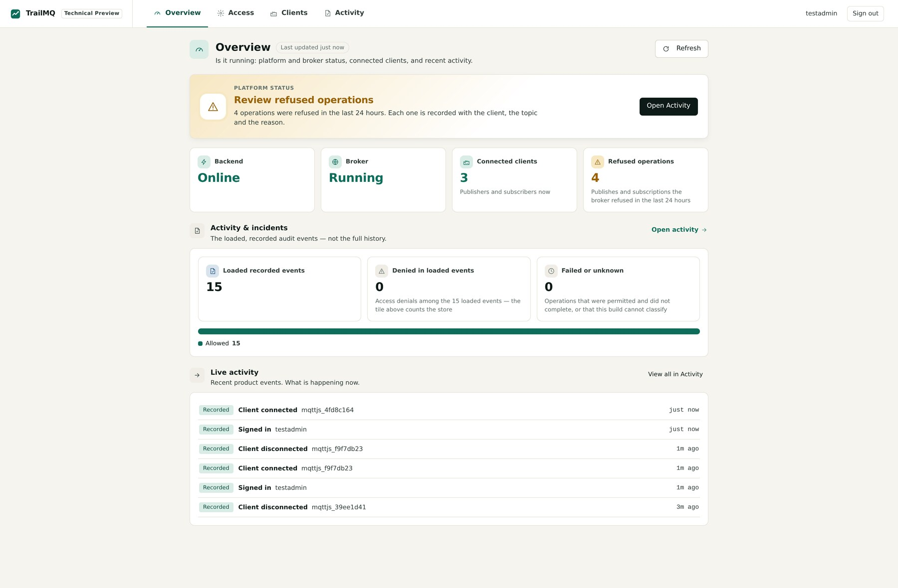
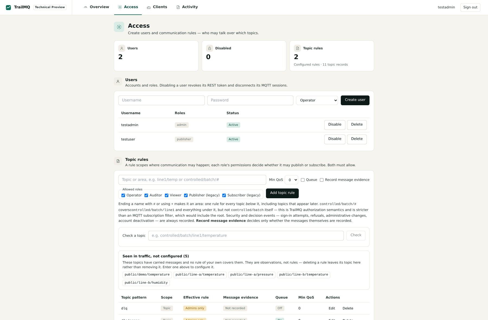
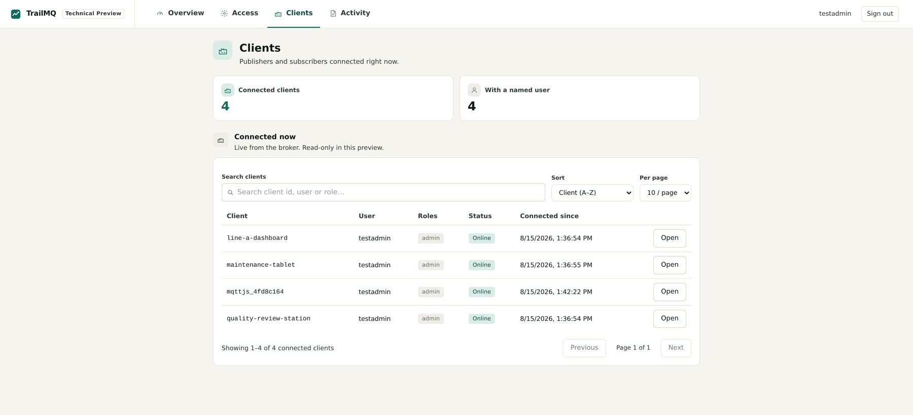

<p align="center"></p>

[](https://hub.docker.com/r/rainergewalt/trailmq-backend)
[](https://hub.docker.com/r/rainergewalt/trailmq-frontend)
[](https://hub.docker.com/r/rainergewalt/trailmq-backend/tags)
[](https://github.com/RainerGewalt/TrailMQ/actions/workflows/distribution-gate.yml)
[](LICENSE)
[](#release-quality)

# Know why MQTT access was allowed or denied

**Policy-controlled MQTT for industrial systems, with attributable and
reviewable access decisions.**

When an MQTT action is refused on a plant network, "it did not work" is not an
answer. Someone still has to know who acted, under which role, on which topic,
and why the answer was no.

TrailMQ is a self-hosted MQTT broker that answers three questions where traffic
enters the system:

- **Who may do what?**
- **What happened?**
- **Why was it allowed or denied?**

Standard MQTT clients connect to it directly. TrailMQ is not open source: this
repository is the free evaluation package, and the runtime ships as signed
images ([what that means](docs/faq.md#is-trailmq-open-source)).

## One Denied Decision

```text
testuser
PUBLISH
restricted/ops/config

DENIED
reason=acl_role_not_in_topic_scope
```


TrailMQ did four things in that same pass:

1. **Decided** the action: the `publisher` role has no rule that brings
   `restricted/ops/config` into scope.
2. **Enforced** the decision: the broker refused the publish before the payload
   could reach a subscriber.
3. **Recorded** user, role, client, action, topic, outcome and reason.
4. **Made it reviewable** in **Activity**, with the actor, MQTT client id, topic
   and plain-language explanation attached.

The same identity publishing to `public/demo/temperature` is allowed and the
payload is observed arriving at a subscriber. Both outcomes come out of the same
two gates: role permission plus namespace/topic rule.

> Scope in one line: the built-in integrity verdict covers the hash-linked
> system/action audit chain; MQTT decision records are recorded and reviewed
> separately. [What the verdict does and does not prove](#trust-and-evidence-scope).

## Try It

Requirements: **Docker 20.10+**, **Docker Compose v2**, **Bash** on Linux,
macOS or WSL, and internet access for the first image pull.

```bash
git clone https://github.com/RainerGewalt/TrailMQ.git
cd TrailMQ
./trailmq try
```

`try` prepares the local evaluation stack, starts it, runs the decision proof,
prints the result in plain language, and opens the Web UI. Want the individual
steps? `./trailmq quickstart` → `./trailmq verify` → `./trailmq open`.

The proof checks more than container health:

```text
[PASS] Authorized publish reached the subscriber   public/demo/temperature
[PASS] Unauthorized publish was blocked            restricted/ops/config
[PASS] Denial recorded with user, role, action and topic
[PASS] System/action audit chain intact
```

Open **http://localhost/trailmq/**, sign in as `testadmin`, then filter
**Activity** by **Outcome: Denied**. The refused publish from the proof is there
with its reason attached.

For your own client, run `./trailmq connect`. It prints the live endpoint, CA
path, generated credentials, allowed and denied test topics, MQTT Explorer
fields, and ready-to-paste `mosquitto` commands. Python, Node.js and browser
WebSocket examples are in [Connect an MQTT client](docs/connect-a-client.md).
If setup fails, run `./trailmq doctor` and see
[Troubleshooting](docs/troubleshooting.md).

## What TrailMQ Does

TrailMQ brings access enforcement and decision review into one workflow. The
decision, reason and record come out of the same pass that allows or refuses
the action.

| Step | What TrailMQ does |
| --- | --- |
| **Authenticate** | The client proves an identity over MQTT/TLS or MQTT over WebSocket. |
| **Authorize** | Two independent gates: the role's own permission, and the namespace/topic rule that scopes where it applies. |
| **Enforce** | The action is carried out or refused at the broker boundary. |
| **Record** | User, role, client, action, topic, time, outcome and reason are kept for review. |
| **Review** | Activity shows what happened, why, and whether the validated chain covers that record. |

Unknown namespaces fail closed until a topic rule grants roles. A role with
`publish:*` can still be denied by the second gate if no namespace or topic rule
brings the requested path into scope.

Around that path, an evaluation also covers the hash-linked system/action audit
chain (validate it, then deliberately tamper with it), standard clients —
`mosquitto`, Python `paho-mqtt`, Node.js `mqtt.js`, browser WebSocket — without
a TrailMQ SDK, and a REST API for topics, policies, queues and effective
settings.

Want the side-by-side comparison? Scenario 0,
[Why not just use a broker?](docs/scenarios/00-why-not-just-a-broker.md), runs
the same commands against default `eclipse-mosquitto` and TrailMQ.

## Evaluation Preview

The public images ship a compact review UI that carries the core path —
**decision -> why -> review**. **Overview** shows runtime status and
review-oriented counters, **Access** the evaluation users and topic rules,
**Clients** the connected publishers and subscribers, and **Activity** the
allowed and refused events with their reasons and integrity scope.

| | | |
| --- | --- | --- |
|  |  |  |

The Preview manages evaluation users and topic rules. It is not the full
operations workspace; use the API or `config.yaml` for remaining policy and
lifecycle operations.

## Trust And Evidence Scope

"Was it blocked?" is three questions, and most systems answer one. TrailMQ keeps
them apart:

| | |
| --- | --- |
| **Outcome** | Was it permitted? Two independent gates decide it: the role's permission, and the topic rule that brings the topic into scope. |
| **Evidence** | Was it written down? Refusals, sign-ins and administrative changes are always recorded. |
| **Integrity** | Is the record covered? A hash-linked chain covers system and action entries and reports its own scope. |

Conflating these three is how a system ends up claiming more than it can show.
The product states the limits below in its own UI, next to the verdict.

**What the integrity verdict covers.** The hash-linked chain walks the
system/action audit store: sign-ins, administrative changes, identity and role
changes, policy changes and topic-rule changes. `./trailmq verify` validates
that chain, and **Activity** shows the same verdict.

**What it does not cover.** MQTT decision records, including publish and
subscribe refusals, are recorded and reviewed separately. The validated verdict
does not prove that every MQTT payload is included, tamper-checked, externally
anchored or digitally signed.

TrailMQ Evaluation Preview is for **local, non-production technical
evaluation**. It is not intended for production operation, safety-related
functions, life-safety systems, emergency control, or use where failure could
directly result in injury, physical damage, or interruption of critical
operations. See [LICENSE](LICENSE).

**What it is not.** A permitted publish is an authorization result, not proof of
delivery; confirm delivery with `./trailmq verify`, a real subscriber and the
Activity decision details. And TrailMQ is a technical building block, not WORM
storage, a notarization service, a CE declaration, a GMP/GxP validation, an
Annex 11 package or a 21 CFR Part 11 package.

The remaining boundaries — local demo assets and config merge semantics — are
listed under
[current evaluation boundaries](docs/README.md#current-evaluation-boundaries).

## Repository Contents

This is the public, Docker-first evaluation package for TrailMQ: the `./trailmq`
launcher and diagnostics, the ready-to-run `secure-mqtt-core` Docker recipe,
release and distribution metadata, configuration examples, guided scenarios, and
the evaluation documentation.

**What you get today is `3.1.1`.** The recipe, Docker tags, README badge,
evaluation bundle and `./trailmq version` are tied together by
[`release.yaml`](release.yaml).

The backend and frontend are delivered as signed Docker images. Their source is
not included in this repository, and the evaluation license does not permit
production or commercial use.

## Release Quality

Published releases are built by an automated pipeline and signed keyless with
cosign, with SBOM and provenance artifacts attached to the published index.
Treat signatures, digests, SBOMs and attestations as evidence for the specific
release tag you evaluate — see
[trust-artifacts.md](distribution/registry/trust-artifacts.md) for what they do
and do not prove, and the
[v3.1.1 release record](https://github.com/RainerGewalt/TrailMQ/releases/tag/v3.1.1)
for the current release of this repository.

Security reports follow [SECURITY.md](SECURITY.md).

## Go Deeper

| Document | Use it for |
| --- | --- |
| [Documentation home](docs/README.md) | Choose the shortest path for your task |
| [Quickstart](docs/quickstart.md) | First successful proof and login |
| [FAQ](docs/faq.md) | Why a publish was denied, auth vs. authz, delivery and chain scope |
| [Connect a client](docs/connect-a-client.md) | CLI, Python, Node.js, WebSocket and access rules |
| [Guided scenarios](docs/scenarios/README.md) | Allow, deny, govern, queue, QoS and tamper exercises |
| [Access management](docs/access-management.md) | Add, rotate and safely revoke evaluation users |
| [Architecture](docs/architecture.md) | Trust model, layers and evidence scope |
| [Secure MQTT Core](recipes/secure-mqtt-core/README.md) | Recipe and REST API reference |
| [Troubleshooting](docs/troubleshooting.md) | Common setup and runtime issues |

Useful commands:

| Command | Purpose |
| --- | --- |
| `./trailmq try` | Guided first run: set up, prove, open |
| `./trailmq connect` | Endpoint, credentials, CA and test topics |
| `./trailmq verify` | Run the decision proof |
| `./trailmq doctor` | Diagnose Docker, config, certificates, credentials and ports |
| `./trailmq down` | Stop the stack and keep local data |
| `./trailmq purge` | Remove the generated recipe runtime |

## License

TrailMQ is distributed under a proprietary evaluation license. It is free for
personal learning, local demos and non-production technical evaluation.
Production, commercial, managed-hosting, redistribution and customer-facing use
require a separate agreement.

See [LICENSE](LICENSE). Commercial contact: **contact@trailmq.com** ·
[trailmq.com](https://trailmq.com)
