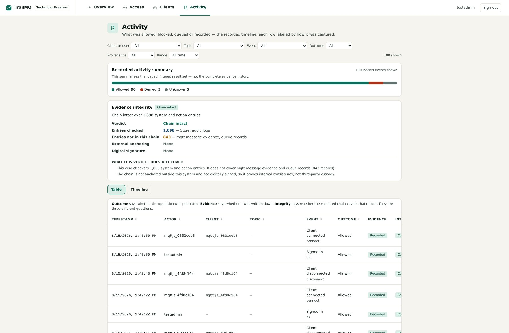

# Scenario 1 — Sensor to dashboard

**Goal:** a machine sensor (`testuser`, role `publisher`) publishes a
temperature reading; a dashboard (`testadmin`) receives it live; TrailMQ
records the decisions and session around the exchange.

**What you learn:** the `public/#` namespace is open to all authenticated
roles out of the box, and connection/authentication activity leaves a
reviewable system/action trace.

## 1. Set up shell variables

```bash
CA=recipes/secure-mqtt-core/certs/ca_cert.pem
ADMIN_PW=$(cat recipes/secure-mqtt-core/secrets/testadmin.pwd)
USER_PW=$(cat recipes/secure-mqtt-core/secrets/testuser.pwd)
```

## 2. Start the "dashboard" (terminal 1)

```bash
mosquitto_sub -h localhost -p 8883 --cafile "$CA" \
  -u testadmin -P "$ADMIN_PW" \
  -i dashboard-1 \
  -t 'public/#' -T 'trailmq/#' -v
```

`-T 'trailmq/#'` hides the policy handshake TrailMQ sends to every new client
(see [Connect a client](../connect-a-client.md)). The terminal now waits.

## 3. Publish as the "sensor" (terminal 2)

```bash
mosquitto_pub -h localhost -p 8883 --cafile "$CA" \
  -u testuser -P "$USER_PW" \
  -i line-1-sensor \
  -t 'public/demo/temperature' -q 1 \
  -m '{"value":21.4,"unit":"degC"}'
```

Terminal 1 prints:

```text
public/demo/temperature {"value":21.4,"unit":"degC"}
```

That is real end-to-end delivery — TLS in, authentication, role check,
namespace check, routing, TLS out.

## 4. See what TrailMQ recorded

Open **http://localhost/trailmq/** and log in as `testadmin`, then open
**Activity**: the client connects, the authentication decisions and the
session lifecycle are recorded events in the timeline, each labeled with how
it was captured.



The same records are available through the REST API — see the
[Secure MQTT Core walkthrough](../../recipes/secure-mqtt-core/README.md).

The Preview is not a payload browser. Delivery proof in this scenario is the
payload received by the MQTT subscriber; the Activity view supplies the
surrounding system/action record.

## Why did this work?

Two checks passed ([access model](../connect-a-client.md#how-trailmq-decides-allow-or-deny)):

1. Role `publisher` has permission `publish:*` (`config.yaml` → `roles:`).
2. Namespace `public/#` allows all authenticated roles by default.

Scenario 2 shows what happens when either check fails →
[Denied by design](02-denied-actions.md).
