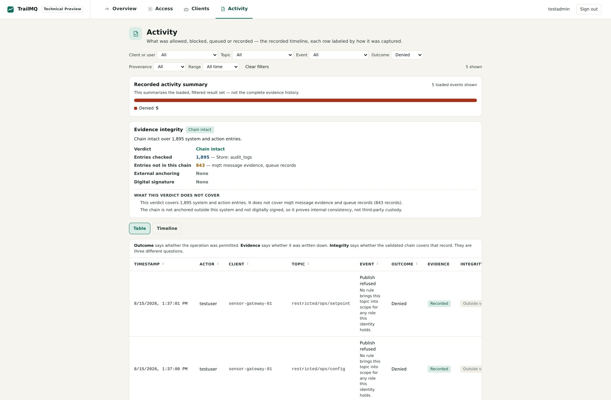

# Scenario 2 — Denied by design

**Goal:** trigger three different denials on purpose and learn to recognize
each one from the client side and in TrailMQ's records.

**What you learn:** TrailMQ fails closed — and a "successful looking" client
call is not the same as a delivered message.

Set up variables (as in scenario 1):

```bash
CA=recipes/secure-mqtt-core/certs/ca_cert.pem
USER_PW=$(cat recipes/secure-mqtt-core/secrets/testuser.pwd)
```

## Denial 1 — wrong credentials

```bash
mosquitto_pub -h localhost -p 8883 --cafile "$CA" \
  -u testuser -P 'definitely-wrong' \
  -t 'public/demo/temperature' -m 'x'
```

```text
Connection error: Connection Refused: not authorised.
```

Rejected at CONNECT. The failed attempt is recorded (Web UI → Activity,
`GET /api/v1/audit/auth`).

## Denial 2 — forbidden namespace

`restricted/#` is admin-only by default. Publish there as `testuser`:

```bash
mosquitto_pub -h localhost -p 8883 --cafile "$CA" \
  -u testuser -P "$USER_PW" \
  -t 'restricted/ops/config' -q 1 -m 'x'
```

```text
Error: A network protocol error occurred when communicating with the broker.
```

Authentication succeeded, but the ACL denied the publish — at QoS 1 the
broker refuses to acknowledge and drops the connection. The broker log shows
the decision:

```bash
./trailmq logs backend | grep ACLMon
# [ACLMon] DENY user="testuser" roles=[publisher] action=publish topic="restricted/ops/config"
```

> **Try the same with `-q 0`** (QoS 0): the command exits without any error —
> and the message is still discarded. QoS 0 has no acknowledgement, so the
> client has no way to notice. This is exactly why the recorded evidence
> matters more than client-side exit codes.

## Denial 3 — publish-only role tries to subscribe

`testuser`'s role (`publisher`) has permission `publish:*` — no `subscribe:`
permission at all:

```bash
mosquitto_sub -h localhost -p 8883 --cafile "$CA" \
  -u testuser -P "$USER_PW" \
  -t 'public/#' -T 'trailmq/#' -v
```

The connection stays up, but **no messages ever arrive** — even if someone
publishes to `public/#` at the same time. The subscription itself was denied:

```text
[ACLMon] DENY user="testuser" roles=[publisher] action=subscribe topic="public/#"
```

## Where the denials are recorded

| Where | What you see |
| ----- | ------------ |
| Web UI → **Activity** | Recorded auth/deny events in the timeline — filter **Outcome → Denied** |
| `./trailmq logs backend \| grep -E 'ACLMon\|AuthMon'` | Every allow/deny decision with user, role, action, topic |
| `GET /api/v1/audit/auth` | Authentication audit events via REST |



Next: instead of being denied, grant a namespace properly →
[Govern a namespace](03-governed-namespace.md).
